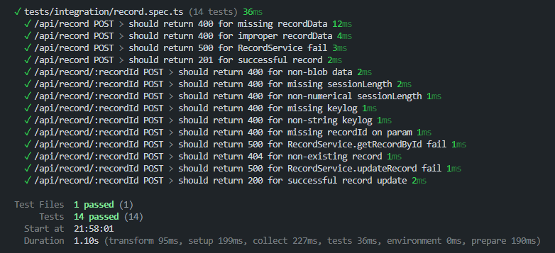
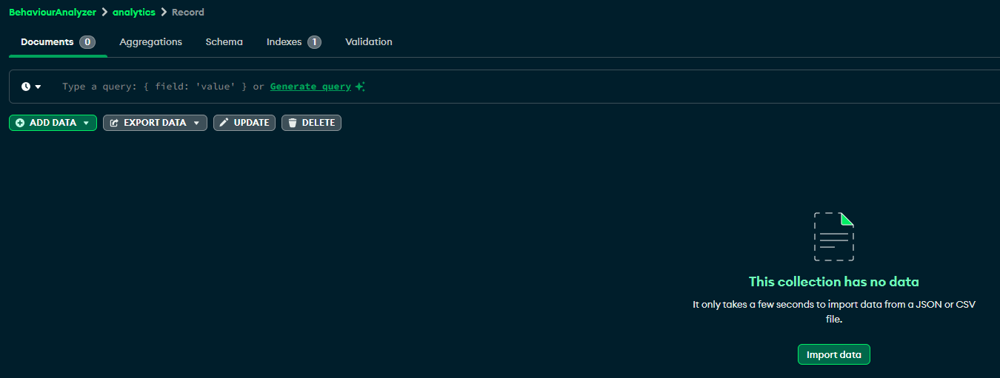
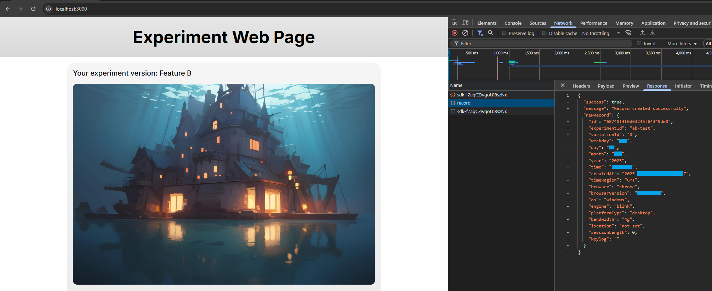
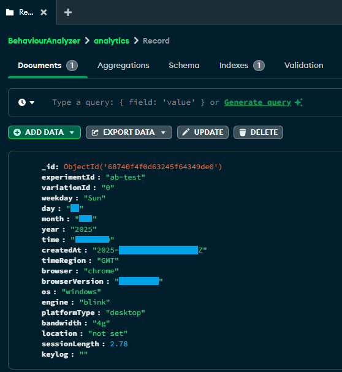
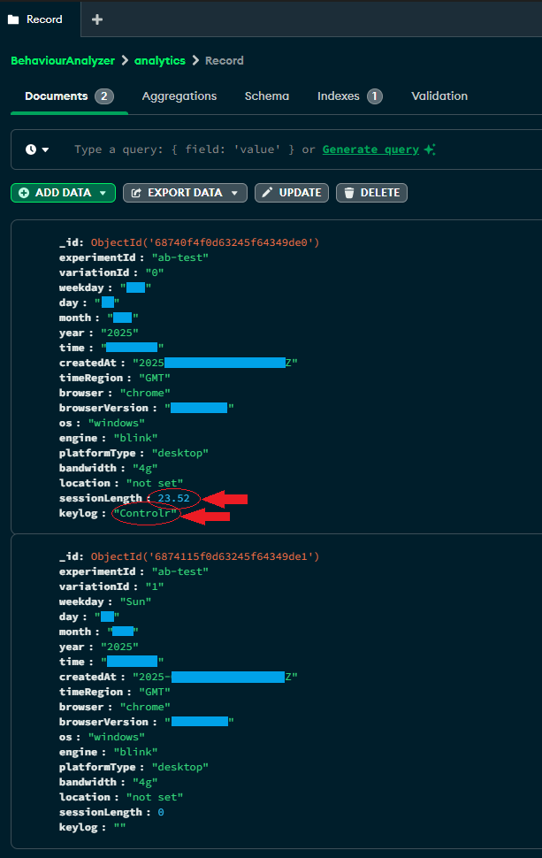

# Experiment web page 🧪

## Features ⭐

The page shows the user a randomized picture and records the user's session length, device, browser, time, and location to a database. With the uploaded metadata, you can then run hypothesis tests to determine if an image affects the user's session length.

---

## How to run 🚀

You need Node.js and npm installed first.

```bash
git clone https://github.com/zhtgeneral/experiments.git
cd experiments
```

Fill in the environment variables. You may have to create a Growthbook account and a new Mongo DB database.

```bash
# Growthbook client key
NEXT_PUBLIC_GROWTHBOOK_CLIENT_KEY=<sdk-...>
# Mongo DB database URL
NEXT_PUBLIC_DATABASE_URL=<mongodb+srv://<username>:<password>@<cluster-name>.avsx0li.mongodb.net/<table-name>?retryWrites=true&w=majority&appName=<cluster-name>
```

❗Warning: The app will fail without the environment secrets.

Once that is done, install the packages

```bash
npm install
```

## Testing the app 🧪

I used Vitest to create the integration tests.

To run the tests, run this command.

```bash
npm test
```

The tests should look something like this


---

## Interacting with the app ✅

First run the app. Use this command.

```bash
npm run dev
```

Open up the database either on the online dashboard or through MongoDB Atlas. Once you can see the table Record in the cluster, continue to the next step. It should look like this.



With the app running, open up `localhost:3000` in a browser and open up the Browser Developer Tools > Network. The app should create a record on startup.



⚠️ Note: if no record is created on the Network, try reloading the page.

✅ Go over to MongoDB Atlas and check that the record was created.



Now we can test if the session length gets updated correctly.

Exit or refresh the page and check the database. You should see something like this.



✅ Check that the session length and key log are recorded.

⚠️ Note: Because I refreshed the page instead of exiting, a new record was created.

---

## Development steps

### Create NextJS, React, Tailwind CSS boilerplate

- `npx create-next-app@latest`
- Select App router, Tailwind, Typescript, and Project name

### Create Prisma for easy database syntax (Mongoose syntax is garbage 🗑️🤮💀)

- Get Prisma for Typescript
  - `npm install prisma typescript tsx @types/node --save-dev`
- Setup schema and config with this file [link to example](./prisma/schema.prisma)
- Get MongoDB connection string
  - +New Project
  - Enter project name
  - Create username and save password
    - ❗You must save the password or else
  - Leave cluster name
  - Connect
  - Drivers
  - Copy connection string (looks like `mongodb+srv://<username>:<db_password>@cluster0.avsx0li.mongodb.net/?retryWrites=true&w=majority&appName=Cluster0`)
  - save to env variables under `NEXT_PUBLIC_DATABASE_URL` and fill in `<username>` and `<db_password>`
- Run these commands to sync with DB
  - `npx prisma generate` (creates local types)
  - `npx prisma db push` (pushes remote changes)

⚠️ Note if you want to use Supabase instead of Mongodb, do these changes

- Get database url from Supabase:
  - Go to supabase
  - Go to project
  - Go to settings
  - Go to Database
  - Select Session mode as the pooler (ends in 5432)
  - Copy and paste the connection string into env under DATABASE_URL
- Update schema.prisma as follows

```bash
datasource db {
  provider = "ponstgreysql" 
  url      = env("NEXT_PUBLIC_DATABASE_URL")
}
```

### Setup Growthbook

- `npm install --save @growthbook/growthbook`  
- `npm install --save @growthbook/growthbook-react` (another way that works. Both can be used)
- setup feature flags on Growthbook Dashboard:
  - Add Experiment
  - Add Feature
  - Link Feature to Experiment
  - Get the client key and save it in env variables under `NEXT_PUBLIC_GROWTHBOOK_CLIENT_KEY`
- Create tracking callback to Growthbook ([example](/app/lib/growthbook.ts))
- Call init before the experiment page in a useEffect

### The rest of the implementation

REST API:

- Create endpoints as needed ([example route](/app/api/record/route.ts) and [example route](/app/api/record/[recordId]/route.ts))

Tracker:

- Create tracking as needed ([example](/lib/Tracker.ts))

Front end:

- Design prototype on Figma:
  - View all projects
  - Create different pages for Mobile and Desktop versions
- Create CSS variables ([example](/tailwind.config.ts))
- Download UI components for example `npx shadcn@latest add skeleton`

Images:

- use a fun AI Image generator (I used [this](https://perchance.org/ai-text-to-image-generator))
- use image upscaler (I used this [one](https://www.iloveimg.com/upscale-image))
- move images to `/public`
  
Deployment on AWS Amplify:

- Select Amplify
- Select correct region
- Create new app
- Select github and branch
- Fill in environment variables
- Deploy for now (will fail)
- Edit build settings
- need the build settings to be
  - preBuild:
    - commands:
      - npm ci --cache .npm --prefer-offline
      - npx prisma generate
  - build:
    - commands:
      - `echo "DATABASE_URL=$DATABASE_URL" >> .env`
      - `npm run build`

(We did this because prisma is build at compile time and environment variables on Amplify are filled after everything has built)
